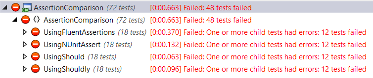
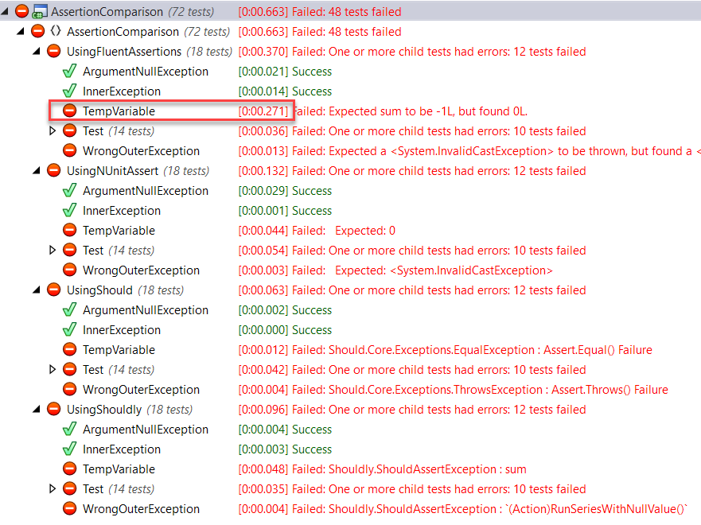

# Comparing Assertion Libraries for .NET Framework

## Motivation

Working with a legacy codebase using NUnit and .NET Framework, I've found that
there is a mix of regular assertions and assertions using the
[Should](https://github.com/erichexter/Should/) library. This library is rather
old and, frankly, limited compared to
[Shouldly](https://shouldly.readthedocs.io/en/latest/) and
[FluentAssertions](https://fluentassertions.com). These newer two frameworks are
significantly more expressive, with APIs that cover myriad situations eleganty.
Questions in front of me:

1. Are any of these libraries really worthwhile compared to simply using NUnit's
   built-in assertions?
2. If using any independent framework, which is the best choice for this code
   base?
3. If selecting Shouldly or FluentAssertions, ought we to upgrade the old
   asserts?

## Why Use a Separate Library?

Some argue that the assertion library simply ought to be independent of the unit
test framework, allowing greater flexibility in switching between frameworks.
Switching unit test frameworks in a large legacy project sounds rather tedious,
so that alone is an insufficient reason.

One problem I've run into frequently in legacy code is people switching up the
expected and actual responses. In NUnit, `expected` comes first:

```csharp
Assert.AreEqual(expected, actual, message);
```

When a coder reverses this, and you need to fix a broken test, it can get a bit
confusing to figure out what is going on (especially if the variables are not so
clearly named). The three fluent frameworks evaluated here address this by
putting the actual result front and center:

```csharp
actual.Should().Be(expected); // FluentAssertions, and Should in Fluent mode
actual.ShouldBe(expected); // Shouldly
actual.ShouldEqual(expected); // Should
```

Another problem is coming up with a meaningful message, which is especially
important if you have multiple asserts in the same unit test (many people frown
at that, and I frown right back unless the coders are prone to large numbers of
mistakes per function). Each of these frameworks reports failures differently.
Compare these results:

* NUnit Assert: `Assert.AreEqual(-1, sum);`
  > Expected: 0 But was:  -1
* FluentAssertions: `sum.Should().Be(-1);`
  > Expected sum to be -1L, but found 0L.
* Should: `sum.ShouldEqual(-1);`
  > Should.Core.Exceptions.EqualException : Assert.Equal() Failure Expected: -1
  > Actual:   0
* Shouldly: `sum.ShouldBe(-1);`
  > Shouldly.ShouldAssertException : sum should be -1L but was 0L

The latter three all provide more information than the first. Of these, I find
the FluentAssertion response to be the most elegant for its compactness and
precision.

## Documentation and Richness

Compared to the other two bolt-on libraries, FluentAssertions clearly has the
best documentation. Detailed and rich with examples, it was easy for me to find
the right syntax for the job. It also clear that the library has extensive
support for value types, references types, collections, and exceptions.

Shouldly's documentation seems to be a work-in-progress. I was unable to find
documentation of their exception handling syntax - I had to look for the
functions in the object browser.

Should's documentation is brief but relatively complete given that it is a
smaller package. Looking at the repo, it also clear that the project hasn't been
touched in many years. This could mean that it simply works - but it also means
that others have passed it by in the meantime.

### Exception Handling

To get a sense of the syntax richness, let's look at exception handling. Aside:
In NUnit, I never use the `[ExpectedException]` attribute as I prefer to have
the assert clearly visible in the method body.

#### NUnit Outer Exception

```csharp
Assert.Throws<ArgumentNullException>(RunNullSeries);
```

#### Fluent Assertions Outer Exception

```csharp
((Action)RunNullSeries)
    .Should()
    .Throw<ArgumentNullException>();
```

#### Should Outer Exception

```csharp
((Action)RunNullSeries)
    .ShouldThrow<ArgumentNullException>();
```

#### Shouldly Outer Exception

```csharp
((Action)RunNullSeries)
    .ShouldThrow<ArgumentNullException>();
```

There is not much difference between these. Fluent Assertions requires one extra
method call. This is a general philosophical difference: it wants you to call
`Should()` first every time, and then exposes the full API. What I like about
this is that it presents a more consistent looking interface, compared to
combining elements together (e.g. `ShouldThrow`, `ShouldBe`, etc.) This might
just be a matter of style.

### Inner Exception Handling

Both Fluent Assertions and Shoudly make it easy to also check on an inner
exception. With the other two frameworks, you're left with catching and
inspecting the exception.

#### Fluent Assertions Inner Exception

```csharp
((Action)RunSeriesWithNullValue)
    .Should()
    .Throw<CalculatorException>()
    .WithInnerException<InvalidOperationException>();
```

#### Shouldly Inner Exception

```csharp
((Action)RunSeriesWithNullValue)
    .ShouldThrow<CalculatorException>()
    .InnerException
    .ShouldBeOfType<InvalidOperationException>();
```

## Execution Time

Across thousands of tests, execution time for these asserts could certainly add
up. Here is one place where FluentAssertions is not as attractive. I wrote the
same tests in each framework and ran them many times. The results below are
representative of the typical results in repeated executions:



Yikes! What's going on here? Let's drill into the results a bit...



There is one test that makes up 73% of execution time. And it is a trivial test:

```csharp
[Test]
public void TempVariable()
{
    var sum = AggregateCalculator.Sum(1, -1);

    sum.Should()
        .Be(-1); // purposefully wrong
}
```

Running that one test repeatedly, by itself, I see similar results. When I run
multiple tests, that one test always seems to take the longest. When I removing
the temporary variable, `AggregateCalculator.Sum(1, -1).Should().Be(-1);`,the
execution time improved a little, but that might have been a fluke of CPU usage.
In these limited tests, Should and Shouldy consistently out-perform
FluentAssertions and NUnit. This is unexpected. Looking at the other tests, this
is a fairly consistent problem. There was only one area where FluentAssertions
seems to be faster - in my parameterized test. These parameterized tests uses the
same syntax, so why should they be so much faster? I wonder if there is some
reflection going on, which is cached after an execution.

## Conclusion

The execution time differences are troubling, but this sample code base is too
small to read too much into it. Setting that aside, FluentAssertions gets my
vote. Perhaps I'll find a way to do a more real-world conversion and comparison.
Without that, I feel that my best choice is to upgrade Should to Shoudly and
perhaps make time to pitch in on improving the documentation.

| Framework | Documentation | Richness | Performance |
|----------|-------------|---------|--------------------|
| NUnit3 | ++ | + | / |
| FluentAssertions | +++ | +++ | - |
| Should | + | + | ++ |
| Shouldly | + | ++ | ++ |